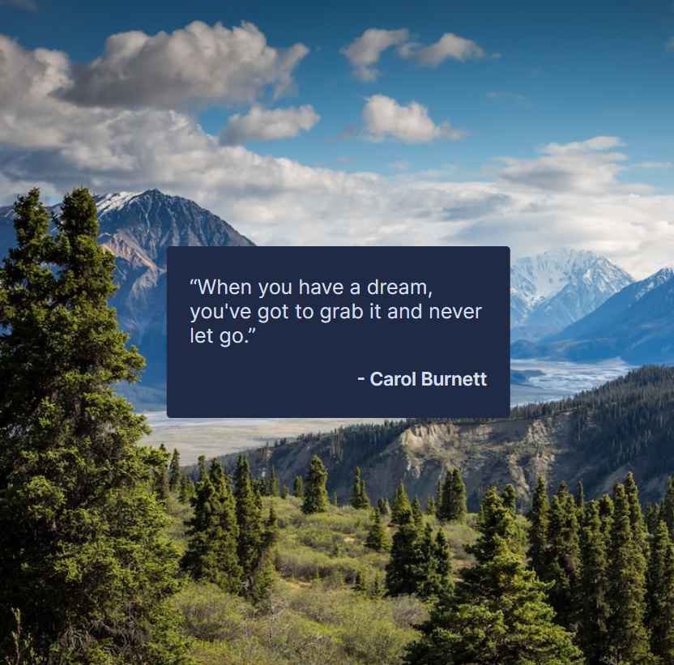

# Inspirational Quote Page - Solo Project 

## A Scrimba Bootcamp Solo Project
Programming Languages Used
<ul>
<li>HTML</li>
<li>CSS</li>
<li>CSS-Flexbox
<li>JavaScript</li>
</ul>

## Screenshot
  
 [Live Demo](https://9tfdev-m2-solo-inspirational-quote.netlify.app/)
 
## Project Requirements
The 'Inspirational Quote Page' solo project meets the following requirements:
<ul>
<li>Build it from 'scratch'</li>
<li>Follow the design to include using:</li>
<ul>
<li>Classes</li>
<li>Background-images</li>
<li>Goole Font: Inter</li>
</ul>
</ul>

My project includes the following 'stretch goals':
<ul>
<li>Change the quote and background image</li>
<li>Use flexbox</li>
<li>Change color of quote box on :hover</li>
<li>Make quote box a link</li>
</ul>

 ## Resources:
 [Figma Design Screenshot](https://github.com/famanakis/m2-solo-inspirational-quote-page/blob/main/figma-design.png) 
 [Scrimba](https://scrimba.com/)

