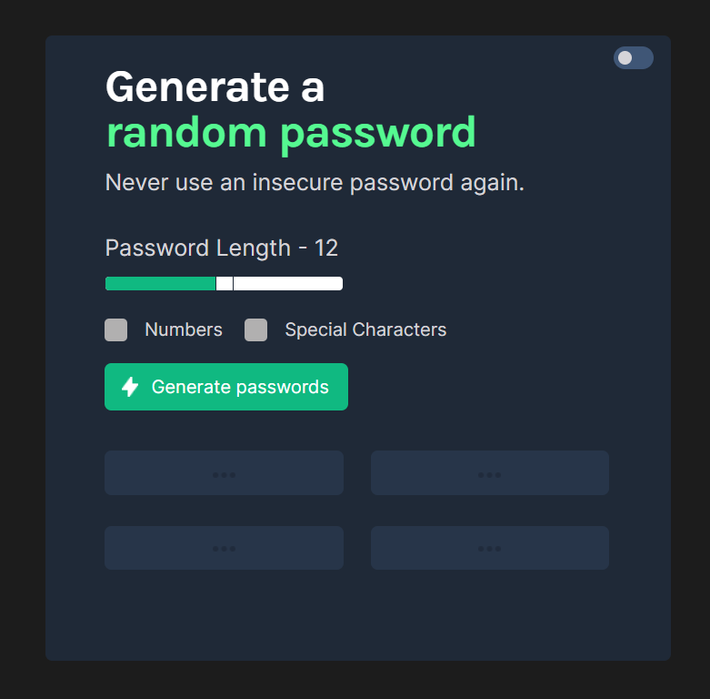
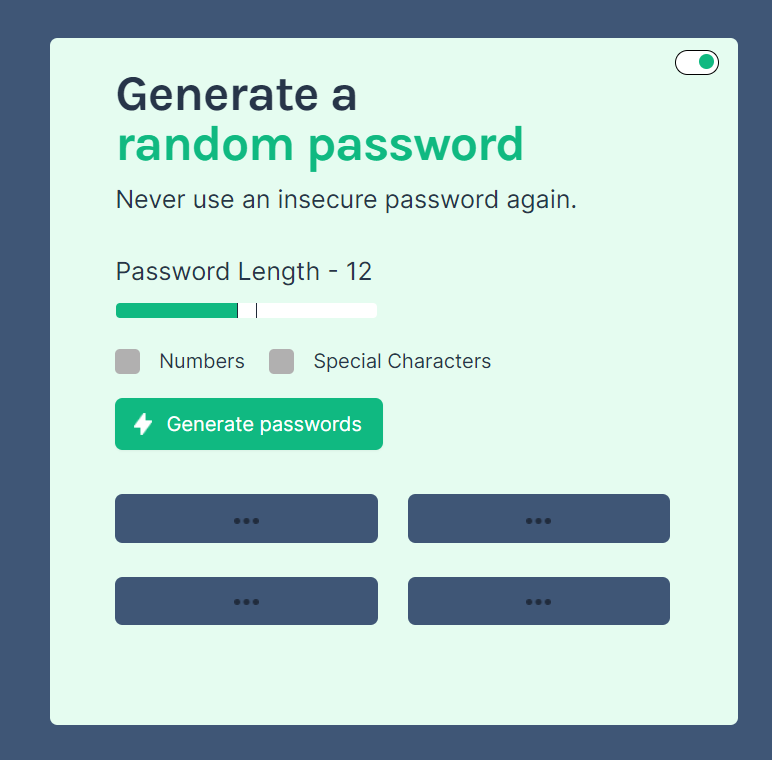

# Password Generator - Solo Project

## A Scrimba FrontEnd Developer Path Solo Project
Programming Languages Used
<ul>
<li>HTML</li>
<li>CSS</li>
<li>CSS-Flexbox</li>
<li>JavaScript</li>
</ul>

## Screenshot
  
  
 [Live Demo](https://9tfdev-m3-solo-password-generator.netlify.app/)
 
## Project Requirements
 The Password Generator solo project meets the following requirements:
 <ul>
 <li>Build it from 'scratch'</li>
 <li>Generate two random passwords when the user clicks the button</li>
 <li>Each password should be 15 characters long</li>
 </ul>
 
 My project includes the following 'stretch goals':
 <ul>
<li>Ability to set password length</li>
<li>Add 'copy-on-click'</li>
<li>Toggle 'symbols' and 'numbers' on/off</li>
<li>Added a toggle for light/dark mode</li>
 </ul>
 
## Resources:
 [Figma Design Screenshot](https://github.com/famanakis/Scrimba/blob/main/m03-solo-password-generator/figma-design.png) 
 [Scrimba](https://scrimba.com/)

