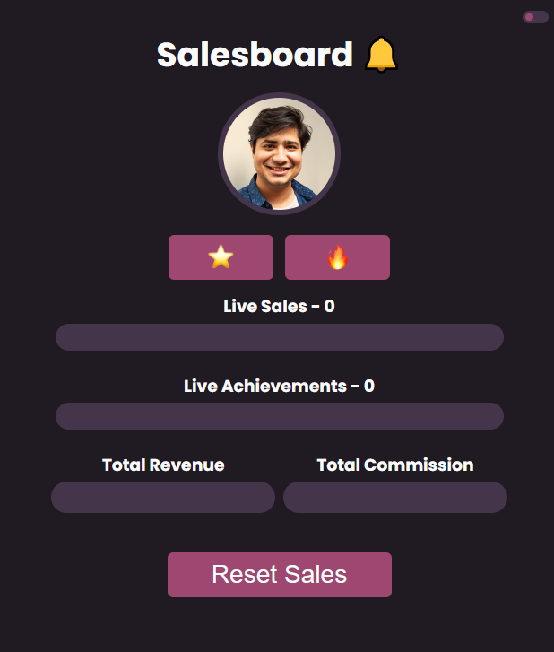

# Salesboard

## A Scrimba Bootcamp Solo Project
Programming Languages Used
<ul>
<li>HTML</li>
<li>CSS</li>
<li>JavaScript</li>
</ul>
 
## Screenshot
  
 [Live Demo](https://9tfdev-m3-solo-salesboard.netlify.app)
 
## Project Requirements
The 'Salesboard' solo project meets the following requirements:
<ul>
<li>Build it from 'scratch'</li>
<li>Follow the design</li>
<li>Make sure you use:</li>
<ul>
 <li>Functions</li>
 <li>Arrays</li>
 <li>Loops</li>
 <li>Objects</li>
</ul>
</ul>

My project includes the following 'stretch goals':
<ul>
<li>Add more achievements</li>
<li>Toggle switch for dark/light mode</li>
<li>Store data in browser</li>
<li>Reset data button</li>
</ul>

 ## Resources:
 [Figma Design Screenshot](https://github.com/famanakis/Scrimba/blob/main/m03-solo-salesboard/figma-design.png) 
 [Scrimba](https://scrimba.com/)

