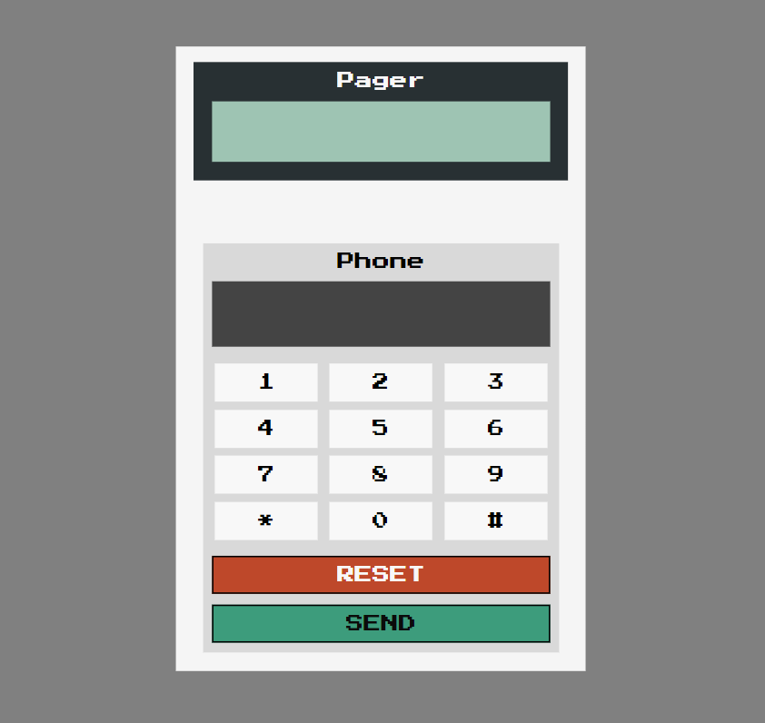

# Send to Pager - Solo Project 

## A Scrimba Bootcamp Solo Project
Programming Languages Used
<ul>
<li>HTML</li>
<li>CSS</li>
<li>JavaScript</li>
</ul>
 
## Screenshot
  
 [Live Demo](https://9tfdev-m3-solo-send-to-pager.netlify.app/)
 
## Project Requirements

The 'Send to Pager' solo project meets the following requirements:
<ul>
<li>Build it from scratch</li>
<li>Follow the design</li>
<li>Make all 14 buttons work</li>
<li>Make the 2 displays work</li>
</ul>

My project includes the following 'stretch goals':
<ul>
<li>Add a time delay</li>
<li>Add a progress bar for page sending</li>
<li>Play a notification sound</li>
<li>Display shouldn't overflow</li>
<li>Disable keypad once text is sent</li>
</ul>

 ## Resources:
 [Figma Design Screenshot](https://github.com/famanakis/Scrimba/blob/main/m03-solo-send-to-pager/figma-design.png) 
 [Scrimba](https://scrimba.com/)

