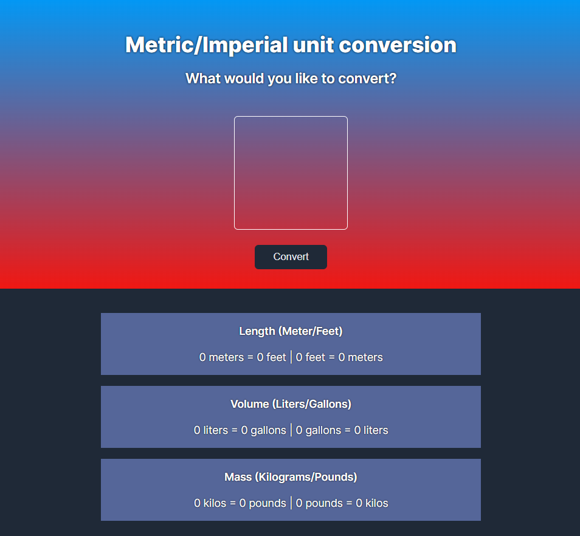

# Unit Converter - Solo Project
## A Scrimba FrontEnd Developer Path Solo Project
Programming Languages and Approach Used
<ul>
<li>HTML</li>
<li>CSS</li>
 <li>CSS-Flexbox</li>
<li>Responsive Web Design</li>
</ul>
 
## Screenshot
  
 [Live Demo](https://9tfdev-m3-solo-unit-converter.netlify.app/)
 
## Project Requirements
 A basic unit convertor that converts a number to various units of measurement to include length, volume, and mass.
 
 # Project Scope
 The 'Unit Converter' solo project meets the following requirements:
 <ul>
 <li>Follow the design spec</li>
 <li>Generate all conversions when the user clicks "Convert"</li>
 <li>Round the numbers down to three decimal places</li>
 </ul>
 
 My project includes the following 'stretch goals':
 <ul>
<li>Choose your own color palette</li>
<li>Clicking on input resets value to blank</li>
<li>Number input grows with text</li>
<li>Set a max-length for the input</li>
 </ul>
 
 ## Resources:
 [Figma Design Screenshot](https://github.com/famanakis/Scrimba/blob/main/m03-solo-unit-converter/figma-design.png) 
 [Scrimba](https://scrimba.com/)
 
 
